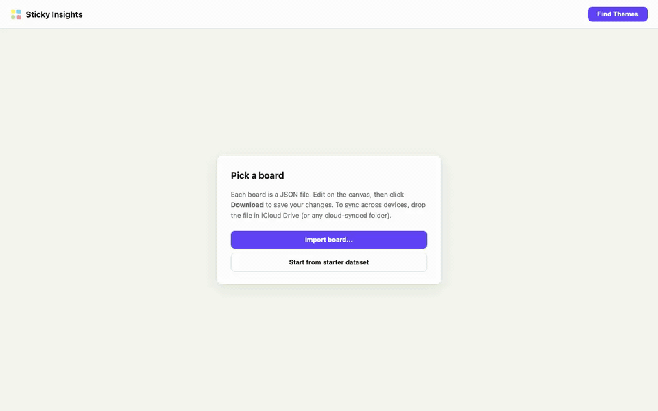
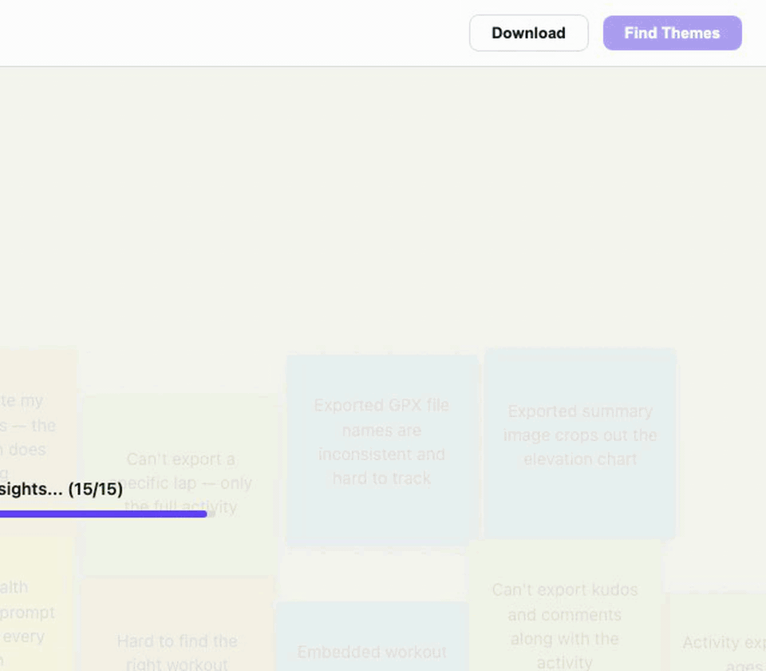
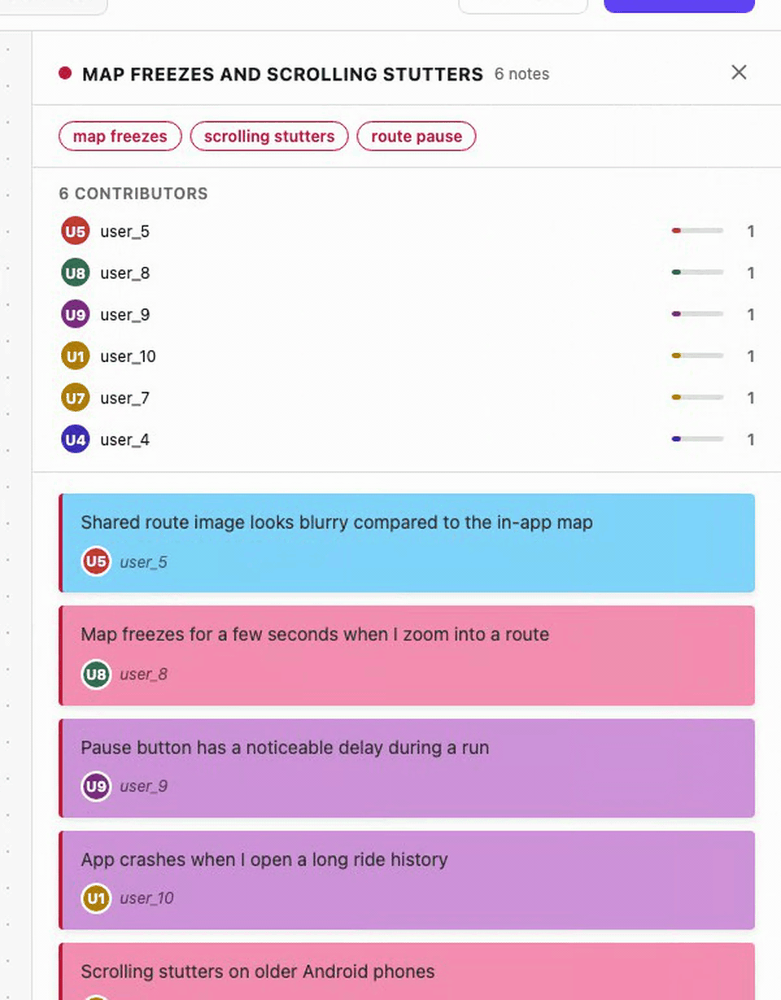
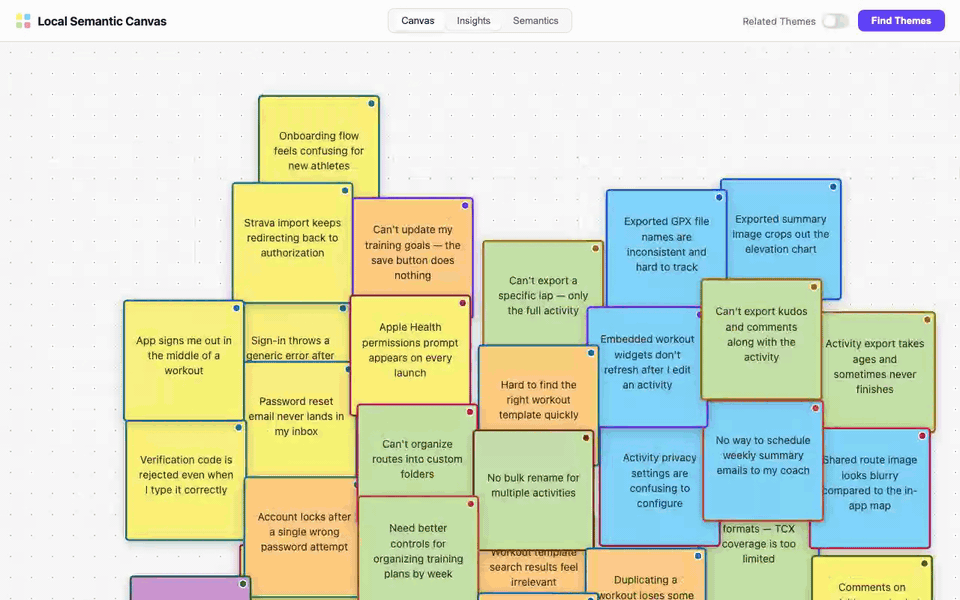

# Sticky Insights

**Live demo → [stickyinsights.vercel.app](https://stickyinsights.vercel.app/)**

## The Problem

**How do you extract insights from user research without sending notes to the cloud?**

When a design session ends, you have fifty sticky notes scattered across a digital whiteboard—raw observations, feature requests, pain points, and opportunities. The synthesis step is traditionally manual: cluster them by theme, name the themes, surface patterns. But privacy constraints often prevent sending note content to a hosted service. This project asks: **can discovery and labelling run entirely client-side, fast enough to be usable, and accurate enough to be trustworthy?**

I built this to answer it.

---

## Why This Matters

We're entering an era where AI is becoming an agent on the user's device, not a service in the cloud. Large models are shipping to the browser. Search is moving on-device. And organisations—from early-stage startups to regulated enterprises—are asking: *what if our analysis never left the device?*

Browser-native ML is not optional for everyone. It's mandatory for companies handling sensitive research (healthcare, finance, security). It's table-stakes for individuals who don't want to sign a data processing agreement to find themes in their notes. And it's a **systems engineering challenge**: embeddings and clustering run on a single-threaded JS runtime, with WASM overheads, no background threads, and tight memory budgets.

**Who this solves for:**
- **UX researchers and design teams** shipping qualitative analysis tools that users trust because data never leaves the browser.
- **Product teams at enterprises** (healthcare, finance, legal) where research data cannot cross a network boundary by regulation.
- **Individuals** who want to analyze their own notes, documents, or recordings without handing raw content to a third party.
- **Founders and engineers** building privacy-first SaaS in research ops, design thinking, or qualitative analysis—this is a working reference for the technical architecture.

**Why browser-native ML is under-explored:**
1. **Cold start friction.** Models are large (~100 MB). The UX must survive a 30-second download and load time the first time, then make that friction disappear permanently via caching.
2. **Single-threaded constraints.** JS runs inference on the main thread. A 40-second embedding pass will freeze the UI. The pipeline must report progress granularly—not a spinner stuck at 95%, but *"embedding… clustering… extracting keyphrases… generating labels"*—so users trust the system hasn't stalled.
3. **WASM overhead.** Quantisation and distillation are mandatory to fit models into browser budgets. A 384-dim sentence encoder is at the edge of what's practical; larger models often aren't worth the weight.
4. **No hosted fallback.** On-device ML can't delegate to a fallback service if it fails. Validation gates, error bounds, and graceful degradation are not optional—they're part of the spec.

### Systems engineering under constraints

This is not an applied ML project. It's a systems engineering project with an ML component. The hard problems are:

- **Run 100+ MB of model weights on a single-threaded runtime** without freezing the UI, using explicit progress messaging to build user trust during long inference stages.
- **Cache model weights in the browser** so the app is offline-capable after the first run, but never persist user content.
- **Validate generated output** (label generation from keyphrases) with three independent gates so the user never sees degenerate output, even when a generative model misbehaves.
- **Design for accessibility as a correctness constraint**, not a polish step—colour alone doesn't work beyond ~7 clusters; add shape (convex hulls) and explicit labels as redundant signals.

Every architectural decision in [ARCHITECTURE.md](ARCHITECTURE.md) is downstream of these constraints.

### A market gap

Privacy-first research ops tooling is vastly underserved. Dedicated SaaS for qualitative analysis (UserTesting, Dovetail, Maze) all require data to leave the device. Browser-native ML opens a new tier: **zero-trust research tools** where the organisation controls the data and the model inference never phones home. This project is a proof-of-concept for that tier.

Specific gaps this addresses:
- Design teams conducting sensitive UX research (healthcare, financial services, government) who need theme extraction without compliance overhead.
- Enterprises with strict data residency policies (EU, China) who need to process notes locally.
- Researchers running on-device experiments with automatic insight extraction—publish the data and the clustering, no proprietary backend needed.

### Open-source reference for browser-native ML

This is a worked example of the tradeoffs in shipping ML to the browser:

- Embedding model selection: why MiniLM (384-dim) over larger encoders—silhouette scores plateau fast on small `n`, and the weight-to-quality ratio favours smaller models.
- Clustering under small `n` (20–80 notes): why a dual-algorithm bake-off (k-means + agglomerative) instead of a single algorithm—each has failure modes the other catches.
- Label generation with validation gates: why fallback to keyphrases when T5 output fails—never show a user generated text you haven't validated.
- Dimensionality reduction for interpretability: why PCA over UMAP/t-SNE—linearity is honest when explaining why clusters are clusters on small datasets.

All failure modes are documented. All tradeoffs are explicit. Clone the repo, read [ARCHITECTURE.md](ARCHITECTURE.md), and adapt it to your own on-device ML problem.

---

## How It Works

**Browser-native semantic clustering for sticky notes. No servers. No API keys. No text ever leaves the tab.**

This repository is an experiment in **on-device ML**: a full discovery pipeline—sentence embeddings, dual-algorithm clustering, contrastive keyphrase extraction, and small-LM label generation—running entirely in WebAssembly on the client. The constraints are the point. No backend, no proxy, no telemetry. Model weights fetched once from a public CDN and cached in the browser; after that, airplane mode is fine. The UX has to stay coherent while heavy models load and run on the main thread. Accessibility is non-optional. Every design decision below is downstream of those rules.

---

## The moment the pipeline runs

Fifty notes, one click. MiniLM embeds the text, two clustering algorithms race, a small language model generates the theme labels — all inside the browser tab. The progress indicator reports *what* is happening, not just *how much*, because a 40-second spinner stuck at 95 % is a user-trust failure, not a loading state.



The first click downloads ~100 MB of quantised model weights. Subsequent runs are sub-second — the Cache Storage API makes the tab genuinely offline-capable after warm-up.

---

## Three views of the same clustering

The pipeline produces one assignment of notes to clusters. I built three views over it because each answers a different question a user actually has after a session ends.

### "Which notes belong together?" — the spatial canvas

The primary view preserves the original x/y layout of the board. After clustering, each note carries a coloured border marking its group. **Related Themes** — a single toggle next to *Find Themes* — overlays convex hulls around each cluster when enabled.



Colour alone saturates around seven clusters regardless of how carefully the palette is designed. The hull overlay adds a second, redundant signal — enclosure — so group membership stays legible beyond that threshold. This is an accessibility decision as much as a design one.

### "What is each theme actually about?" — the insights view

The *Insights* tab reorganises the board by cluster. Tiles carry the generated label, the top keyphrases, and a contributor avatar strip. Clicking a tile slides in a detail panel: the full phrase list, every member note, and who wrote what.


The labels are not heuristic rewrites of the top keyphrase. A small language model (LaMini-Flan-T5-248M, running in WASM) generates them from the keyphrase set, then three validation gates — degeneracy, cosine relevance, vocabulary — decide whether to accept or fall back. About 5–8 of 10 generations pass the gates; the rest fall back to the top keyphrase. The user never sees a bad label, because a rejected label is never shown.

### "Whose voices built this theme?" — the contributor breakdown

Inside the detail panel, a breakdown shows how many notes each author contributed. A flat bar distribution signals consensus — multiple people independently raised the same concern. A single tall bar signals an individual voice carrying the theme alone. Both readings are valid; making the shape visible is the point.



This matters for downstream decisions. A risk raised by seven people deserves different handling from one raised by one. The pipeline can't make that judgement, but it can surface the shape so humans can.

### "Why are the clusters the clusters?" — the semantic space

The *Semantics* tab projects the 384-dimensional MiniLM embedding space down to 2-D via PCA. On-screen distance approximates cosine distance in the original space — the same metric the clustering algorithms used.



I chose PCA over UMAP / t-SNE deliberately. PCA is deterministic, parameter-free, and fast enough to recompute every re-cluster. UMAP and t-SNE reveal more structure on large corpora but require hyperparameter tuning and can fabricate apparent clusters on small `n`. For a view whose purpose is to **explain the clustering**, the linear projection is the honest choice.

---

## Running It

**Requirements:** Node.js 18+ and npm.

```bash
npm install
npm run dev
```

Open [http://localhost:5173](http://localhost:5173).

### What happens on first run?

1. **Model discovery and download.** The app detects that MiniLM and FLAN-T5 are not yet cached. It fetches both models (~102 MB total in quantised form) from the Hugging Face CDN.
2. **Cache Storage write.** Models are written to the browser's Cache Storage API. This cache persists across sessions and is not cleared by regular cache eviction.
3. **Offline-capable.** After the first run, the app is fully offline. Close the browser, unplug from the network, reopen the page—inference runs at full speed with cached models.
4. **Data loading.** The sticky notes load from [public/data/sticky_notes.json](public/data/sticky_notes.json) on start. The UI is interactive immediately; users can pan and zoom the canvas while models download in the background.

### Success criteria — Verify clustering works

After starting the app:

1. **Load the sample board** — 50 sticky notes should appear on the canvas at various positions.
2. **Click "Find Themes"** at the top right. The progress indicator should update through stages: *embedding → clustering → keyphrase extraction → label generation*.
3. **Inspect the output:**
   - The canvas notes should have coloured borders (cluster assignments).
   - Click the **Insights** tab. You should see 3–4 clusters with generated labels like "Authentication issues" or "Sync problems".
   - Click **Related Themes** toggle. Coloured convex hulls should overlay each cluster on the canvas.
   - Click the **Semantics** tab. A 2-D scatter plot should show notes positioned by semantic similarity.
4. **Verify caching.** Reload the page. The second run should take < 2 seconds (no model download).

### Using your own notes

Replace [public/data/sticky_notes.json](public/data/sticky_notes.json) with any JSON array matching the schema:

```json
{
  "id": "note_123",
  "text": "Login flow is confusing",
  "x": 412,
  "y": 891,
  "author": "user_7",
  "color": "yellow"
}
```

Supported colours: `yellow`, `pink`, `blue`, `green`, `purple`, `orange`, `white`.

---

## Tests

```bash
npm test
```

Opens [test.html](test.html) in the browser. Two suites run: a 16-note dataset covering three clear themes plus ambiguous and singleton edges, and a 3-note dataset exercising the `n < 5` fallback path. Models must be cached — run `npm run dev` once and click *Find Themes* before testing on a fresh browser profile.

---

---

## What This Taught Me

### Distributed inference under tight constraints

Running embeddings + clustering + label generation on a single thread is a constraint optimization problem, not an algorithmic one. I learned:

- **Granular progress reporting is trust-building.** Users don't mind a 40-second embedding pass if the UI updates every 2 seconds saying *"embedding 37 of 50 notes"*. A silent spinner stuck at 95% feels broken, even if it's just slow.
- **Worker threads are not available in browser ML.** `@xenova/transformers` runs in the main thread. Some operations (like vectorizing all notes) can't be parallelised without moving to Web Workers, which adds complexity. Batch processing and early stopping are the levers you have.
- **Quantisation is mandatory below ~384 dims.** Full-precision FLAN-T5 doesn't fit in a reasonable browser cache budget. The quantised version costs 2-3% accuracy loss but saves 4× memory. It's a worthwhile tradeoff.

### User trust architecture

Progress messaging is not UX polish—it's part of the reliability contract.

- A user seeing *"clustering: silhouette score 0.67"* understands the system is doing real work, not hallucinating.
- A user seeing *"generating label… (attempt 3 of 5)"* understands that label generation is non-deterministic and might fail gracefully.
- A user toggling **Related Themes** and immediately seeing convex hulls trusts that the clustering output is deterministic and stable.

I built explicit logging of intermediate values (silhouette scores, cluster counts, acceptance rates on label validation) into the progress UI. This turned "progress indicator" from a spinner into a diagnostic channel.

### Privacy-first product thinking

Data minimization in the UI means more than just not sending data over the network:

- The app never writes user content to localStorage (models only, via Cache Storage).
- Sticky note IDs are temporary; there's no mechanism to persist a user's clusters or export derived data. (A production version would add that, but opt-in, with an explicit export gesture.)
- The detail panel shows *how many notes* each author contributed to a cluster, not *which notes*. This surfaces the shape of consensus without forcing the app to track per-author note content.
- Accessibility is enforced at the code level: semantic HTML, keyboard navigation, colour contrast checks in the palette—not bolted on later.

---

## Deeper Reading

The short version of the pipeline is **embed → cluster → keyphrase → label**, with a dual-algorithm bake-off at the cluster stage, multi-signal keyphrase scoring, and three validation gates on generated labels. The decisions behind each stage—why MiniLM and not a larger embedder, why silhouette and not elbow, why generate labels instead of ranking keyphrases, which failure modes still exist—live in [ARCHITECTURE.md](ARCHITECTURE.md).

---

## Stack

| Package | Purpose |
|---|---|
| `@xenova/transformers` | In-browser WASM inference for MiniLM and FLAN-T5 |
| `ml-kmeans` | k-means++ clustering |
| `d3` | SVG rendering for the canvas and semantic-space views |
| `vite` | Dev server and build tool |

No React, no backend, no external API keys. Vanilla JS, ES modules.

---

---

## Regenerating the GIFs

Every clip above is produced by a single Playwright session that records one continuous user flow, then segments it into five scenes via ffmpeg palette-quantisation:

```bash
npm run dev                    # terminal 1
npm run capture-gifs           # terminal 2
```

Scene definitions live in [scripts/capture-gifs.mjs](scripts/capture-gifs.mjs). The underlying capture agent is under `~/.claude/agents/browser-capture.md` and is reusable across any Vite/Playwright project — give it a URL, a list of interaction steps, and an output path.

---

## License

MIT.
